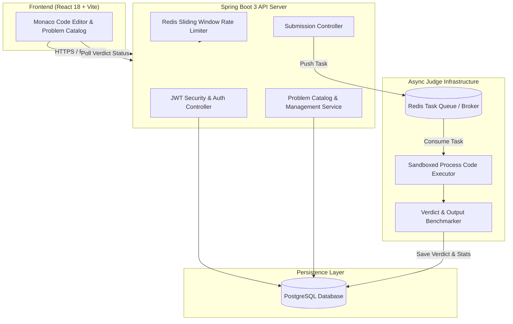

# ⚔️ CodeForge — Distributed Online Judge & Code Execution Platform

[](https://react.dev/)
[](https://spring.io/projects/spring-boot)
[](https://openjdk.org/)
[](https://redis.io/)
[](https://www.postgresql.org/)
[](https://vercel.com/)
[](LICENSE)

**CodeForge** is a high-performance, distributed Online Judge and competitive programming platform designed for executing and benchmarking user code in real time. It features a modern IDE interface with Monaco Editor, asynchronous task queue evaluation via Redis, and isolated process sandboxing.

---

## 🌟 Key Features

- **💻 In-Browser IDE Workspace**: Powered by **Monaco Editor** (the code editor underlying VS Code) with syntax highlighting, autocomplete, code resetting, and multi-language support (**Java 21** & **C++ 17**).
- **⚡ Asynchronous Code Execution Engine**: Submissions are queued asynchronously using **Redis Task Pipelines**, keeping API controllers non-blocking and highly responsive under heavy submission spikes.
- **⏱️ Precision Benchmarking & Verdict Evaluation**: Measures execution runtime in milliseconds and memory consumption in kilobytes, detecting verdicts including `ACCEPTED`, `WRONG_ANSWER`, `TIME_LIMIT_EXCEEDED`, `COMPILATION_ERROR`, and `RUNTIME_ERROR`.
- **🛡️ Sliding Window Rate Limiting**: Intercepts abusive submission bursts with a custom **Redis Sliding Window Rate Limiter** to protect execution nodes against DDoS and resource starvation.
- **🔐 JWT Authentication & User Statistics**: Secure user registration, authentication, problem solving counters, rating tracking, and submission history.
- **🌐 Zero-Downtime Demo Mode**: Built-in intelligent fallback for static frontend deployments (e.g., Vercel) allowing immediate catalog exploration and code evaluation even when disconnected from a live backend.

---

## 🏗️ System Architecture



---

## 🛠️ Tech Stack

| Domain | Technologies |
| :--- | :--- |
| **Frontend** | React 18, Vite, Monaco Editor (`@monaco-editor/react`), Lucide Icons, Canvas Confetti |
| **Backend Framework** | Spring Boot 3, Spring Security, Spring Data JPA / Hibernate |
| **Languages Supported** | Java 21 (OpenJDK), C++ 17 (`g++`) |
| **Queue & Caching** | Redis (Sliding Window Rate Limiter & Task Dispatcher) |
| **Database** | PostgreSQL, Flyway Schema Migrations |
| **Build Tools** | Maven (Backend), npm / Vite (Frontend) |
| **Hosting & Deployment**| Vercel (Frontend SPA), Docker / Render / Railway (Backend) |

---

## 🚀 Quick Start & Local Setup

### Prerequisites

Ensure you have the following installed locally:
- **Node.js**: `v18.x` or higher
- **Java Development Kit (JDK)**: `17` or `21`
- **Maven**: `3.8+`
- **PostgreSQL**: `v14+` running on port `5432`
- **Redis**: running on port `6379`

---

### 1. Database Setup

Create a PostgreSQL database named `codeforge_db`:

```sql
CREATE DATABASE codeforge_db;
```

---

### 2. Backend Setup (Spring Boot)

Navigate to the `backend/` directory:

```bash
cd backend
```

Configure your database and Redis credentials in `src/main/resources/application-local.yml` or set environment variables:

```bash
export DB_URL=jdbc:postgresql://localhost:5432/codeforge_db
export DB_USERNAME=postgres
export DB_PASSWORD=your_password
export REDIS_HOST=localhost
export REDIS_PORT=6379
```

Run Flyway migrations and start the backend application:

```bash
./mvnw spring-boot:run
```

The Spring Boot backend will start on **`http://localhost:8080`**.

---

### 3. Frontend Setup (React + Vite)

In a new terminal window, navigate to the `frontend/` directory:

```bash
cd frontend
npm install
npm run dev
```

The frontend application will start on **`http://localhost:5173`**.

---

## 📡 API Endpoints Overview

| Method | Endpoint | Description | Auth Required |
| :--- | :--- | :--- | :---: |
| `POST` | `/api/v1/auth/register` | Register a new user account | ❌ |
| `POST` | `/api/v1/auth/login` | Authenticate user & return JWT token | ❌ |
| `GET` | `/api/v1/users/me` | Fetch authenticated user profile & stats | ✅ |
| `GET` | `/api/v1/problems` | List problems with search & difficulty filters | ❌ |
| `GET` | `/api/v1/problems/{slug}` | Get full problem statement & sample test cases | ❌ |
| `POST` | `/api/v1/submissions` | Submit code solution for execution | ✅ |
| `GET` | `/api/v1/submissions/{id}` | Poll submission execution status & verdict | ✅ |
| `GET` | `/api/v1/submissions/problem/{slug}` | List past submissions for a specific problem | ❌ |

---

## ☁️ Deployment

### Frontend (Vercel)
The `frontend/` directory includes a pre-configured `vercel.json` for single-page routing:
1. Connect your repository to **Vercel**.
2. Set **Root Directory** to `frontend`.
3. Set Environment Variable `VITE_API_BASE_URL` to point to your live backend endpoint.

### Backend (Render / Railway / Docker)
The Spring Boot application can be deployed using standard Docker containers or Maven build packs on platforms like Render or Railway alongside a managed PostgreSQL database and Redis instance.

---

## 📜 License

This project is licensed under the MIT License — see the [LICENSE](LICENSE) file for details.
